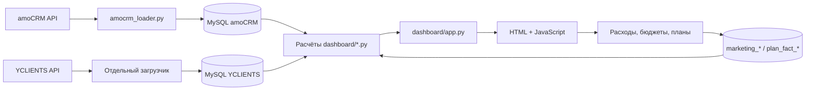

# Архитектура

`create_app()` собирает Flask-приложение и репозитории в `app.extensions`. Обработчики в `app.py` проверяют авторизацию/параметры, вызывают расчёты и возвращают JSON, HTML или файл. ORM нет: используется PyMySQL и параметризованный SQL. Бизнес-расчёты выполняются в Python; `Decimal` применяется к денежным значениям. Часть результатов кэшируется в памяти процесса.

| Раздел | Расчёты/хранение | JavaScript |
|---|---|---|
| `/` и `/verification` | `analytics.py`, `classifier.py`, `marketing_analytics.py`, `trend_analytics.py` | `app.js`, `verification.js` |
| `/expenses` | `marketing_expenses.py` | `expenses.js` |
| `/budgets` | `budget_planning.py` | `budgets.js` |
| `/funnel` | `funnel_analytics.py` | `funnel.js` |
| `/calls` | `call_analytics.py` | `calls.js` |
| `/yclients` | `yclients_analytics.py`, `yclients_rules.py` | `yclients.js` |
| `/plans`, `/yclients/plan-fact` | `plan_fact.py` | `plans.js`, `plan_fact.js` |
| `/call-recordings-demo` | `call_recordings_demo.py`, `amocrm_client.py` | `call_recordings_demo.js` |

Пути таблицы относительны `dashboard/`, JS — `dashboard/static/`. HTML находится в `dashboard/templates/`. CSS и JS физически отдельные файлы, но приложение встраивает их в HTML: это поддерживает размещение на Passenger без отдельной раздачи static. Скрипт получает nonce, соответствующий CSP текущего ответа. Изменение JS/CSS требует перезапуска production-процессов: файлы читаются при создании приложения.

## Границы записи

- Основная аналитика читает исходные amoCRM/YCLIENTS-таблицы.
- Формы записывают управленческие данные и аудит в `marketing_*`, `plan_fact_*`.
- GET план–факта также вызывает `sync_booking_events()` и `sync_issues()` с записью/commit. Не считать этот GET безопасным для read-only подключения.
- Загрузчик amoCRM обновляет реплику; обновление OAuth меняет `amo_oauth_tokens`.
- Аудио проксируется потоком, а не сохраняется в репозитории.

## Конфигурация, привязанная к бизнесу

`tag_mapping.json`, `USER_RULES_BY_ID` в `call_analytics.py`, причины исключения в `analytics.py`, словарь филиалов и правила услуг в `yclients_analytics.py` — часть текущей модели заказчика. Менять их вместе с примерами и тестами; не считать универсальными справочниками.
